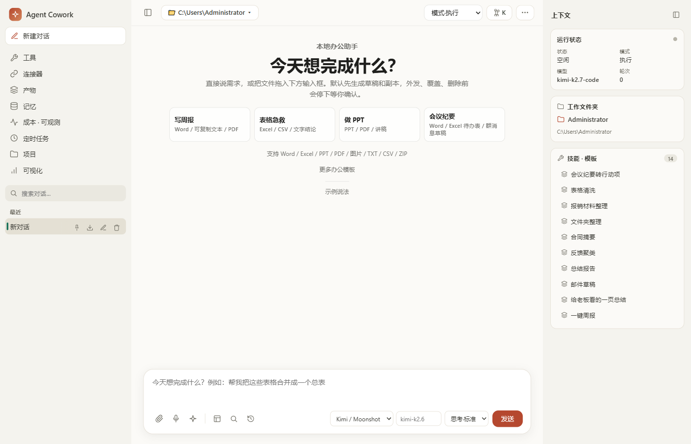

# Agent Cowork

[](https://github.com/zbl1998-sdjn/agent-cowork/actions/workflows/ci.yml)


> **当前状态（2026-07-12）：v0.4.0 Internal Beta，仅供受控试用。** 当前主产品是 `Tauri 2 桌面壳 + React UI + Node SEA host sidecar`，根包、UI、Cargo 与 Tauri 的版本字段均为 `0.4.0`。本地质量门禁可以生成版本匹配的 NSIS 候选包，但当前没有可信 CA 代码签名，updater 仍是占位配置；未签名安装包、源码门禁和外部发布验收是三条不同证据边界，不应据此宣称公开生产可用。

一个面向 Windows 本地协作场景的 Agentic Cowork 项目，让 AI Agent 帮你完成本地文件操作、代码执行和跨工具协作任务。



<!-- TODO: 录制 demo.gif 后替换上图，分镜脚本见 docs/media/GIF分镜脚本.md -->

## 30 秒了解

- **它是什么**：Windows 本地 Agent 工作台——AI 在你电脑上读写文件、跑代码、产出 Word/PPT/Excel；写操作先出计划，你审批了才动手。
- **它的差异点**：安全边界是第一公民——5 档安全模式、统一出站网关 + 审计留痕、路径 jail、沙箱执行、记忆 DLP 脱敏。不是又一个聊天壳。
- **怎么验证**：下面的快速开始 3 条命令能真跑起来；`npm run demo:mvp` 一键做完整演示验收；合并级门禁是 `python -X utf8 scripts/quality_gate.py --level full`。README 里每条能力都能在源码和 smoke 脚本里对上号。

## 快速开始

前置：Windows + Node ≥ 20（实测 Node v24.16.0，2026-07-17）。

```powershell
git clone https://github.com/zbl1998-sdjn/agent-cowork.git
cd agent-cowork
npm install
npm run start:mvp   # 启动本地工作台并打开浏览器（默认 http://127.0.0.1:3017）
npm run stop:mvp    # 用完停止
```

不依赖任何云端 API key：模型默认走本机 Ollama / LM Studio（配置示例见下文「验收与演示」）。一条命令做完整演示验收：`npm run demo:mvp`（启动 + live 操作测试 + 审计，报告写入 `build/mvp-demo-report.json`）。

**核心能力：**
- **Agentic tool-calling loop**：模型自主决策调用 Read/Write/Edit/Glob/Grep/Shell/WebFetch 工具，多步完成复杂任务
- **Plan Mode**：生成可审批的执行计划，用户批准后才执行写操作
- **MCP 协议栈**：完整四层实现（StdioTransport → JsonRpc → McpClient → connect），命名空间 `mcp__<server>__<tool>`
- **运行时稳定性机制**：CircuitBreaker 三态机（closed/open/half-open）+ Token Bucket 限流 + ApprovalRegistry TTL 防挂起
- **可切换存储适配器**：本地桌面验收使用 SQLite；PostgreSQL 适配器、迁移和 LISTEN/NOTIFY 接线已在源码与 mock-pool 测试中覆盖，但真实 PostgreSQL、多实例部署和故障恢复仍需要独立环境验收，不能由本地单元测试替代
- **长期记忆桥接（可选，MASE）+ 内置分层记忆**：内置五层记忆（企业/用户/项目/本地/会话）默认注入；可选接入外部 MASE MCP 记忆后端（独立仓库，不随本仓库分发），每轮开始注入「本线程最近对话 + 当前结构化事实 + 跨会话相关历史」，每轮结束写回并抽取结构化事实；召回硬超时 2.5s，未配置或超时一律安全降级为不带记忆，不阻塞对话。所有记忆写入统一过 DLP 分级拒绝疑似凭据（API key/token/密码），注入模型前再做一次读侧脱敏兜底（历史遗留旧密钥也不会被回放进上下文）；记忆暂停/隐身开关对内置记忆与 MASE 桥接一致生效
- **安全护城河 / 出口治理**：5 档安全模式（`local_demo`/`local_strict`/`enterprise_local`/`air_gap`/`controlled_hybrid`）+ 统一出站网关对模型调用/WebFetch/WebSearch/连接器/插件下载做策略判定与审计留痕（`.AgentCowork/security/egress-audit.jsonl`），前端安全状态条实时展示当前档位与「外发 N B」；工具风险分类（`network_external`/`sandbox_exec`/`connector`/…）让 `local_strict`/`air_gap` 下自动拦截对外网络工具（含 WebSearch）与非网络隔离沙箱执行
- **多 Provider 目录**：内置 14+ 家 OpenAI-compatible / Anthropic 兼容 provider（Kimi/Moonshot、DeepSeek、通义千问、智谱 GLM、火山方舟、百度千帆、腾讯混元、MiniMax、讯飞星火、硅基流动、OpenAI、Anthropic/Claude、Ollama、LM Studio、自定义 OpenAI-compatible）。当前 Internal Beta 的可执行路径限本机 Ollama/LM Studio 与管理员明确放行的客户网关；公网云 provider 只提供目录/配置发现，审批回执消费链完成验收前会 fail-closed
- **一键办公配方**：内置周报草稿、给老板看的一页总结、聊天转行动项清单、PPT 初稿、正式 Word、邮件初稿等配方，产出 Markdown/DOCX/XLSX/PPTX/PDF；支持把一次真实操作「存成我的配方」复用
- **Agent Skills(SKILL.md)开放标准技能包(第一阶段)**：把符合 agentskills.io 标准的技能包目录放进工作区 `.AgentCowork/skills/<name>/`(含 `SKILL.md`),对话时会按渐进披露自动注入技能目录,模型经只读 `LoadSkill` 工具按需读取完整指令与 `references/` 参考文档;技能包附带脚本一律不执行,内容按不可信数据包装,读取纯本地、零出站
- **子代理**：`/api/subagent/run`（单个，只读/低风险直跑，写入型仍走审批）与 `/api/subagent/parallel` + `AgentParallel` 工具（并发派发多个子任务，各自独立上下文预算/步数上限，子任务生命周期事件前端分组展示）
- **Agent 运行时韧性**：LoopGuard（重复调用/连续失败打断）、有界重试（仅对可重试错误退避）、BudgetGuard（token/成本/wall-clock 硬上限）、整轮超时、流式中断保留已生成内容、Checkpoint/Resume（可从崩溃点续跑、不重放已完成写操作）、InjectionGuard（工具输出包成不可信数据块，检测提示注入/工具劫持/数据外泄/审批绕过模式）
- **可观测性 + 确定性评测**：每次 run 自动带 token/成本/耗时/工具/失败率与决策 trace，前端可观测面板可查历史 run；`npm run eval` 跑 golden + 红队任务集，走离线回放后端（ModelRecorder/Replayer），默认必须提供 replay records 才回放（缺失 fail-closed）
- **运行时依赖管理**：设置页展示 SQLite / 内置 Python / Node / CJK 字体 / VC++ 运行库 / Chromium / OCR（Tesseract 中文包）/ Pandoc / MinGit / ffmpeg / 数据分析组件等的可用性，只生成可审查的安装/清理/更新计划，不静默下载或删除
- **定时任务**：cron 5 段或一次性 `fireAt` 调度执行配方/工具
- **安全边界**：path-policy trusted root jail + 敏感段黑名单（含 Windows 文件名等价/NTFS ADS 归一，防绕过）+ symlink 解析 + redaction 脱敏 + JWT 鉴权（HS256 锁定 + timingSafeEqual）+ 出站 SSRF 守卫（解析后 IP 判定 + 逐跳重定向复核）+ Host 头白名单（防 DNS-rebinding）+ 全链路 `shell:false`
- **小白友好前端**：首页「今天想完成什么」任务卡（周报/表格急救/PPT/会议纪要等常见场景），安全状态条实时展示当前安全档位与外发字节数，专家术语（MCP/Provider/Shell 等）默认不出现在小白视图
- **全栈**：Node.js 后端 + React/TypeScript 前端 + Tauri 2 桌面端 + Node SEA 打包

**验证入口与证据边界：**
- 本地源码的完整门禁是 `python -X utf8 scripts/quality_gate.py --level full`；它的本次命令输出才是当前工作树的通过/失败证据，不在 README 固化会随代码增长而过期的测试数或覆盖率。
- Host 覆盖率摘要由 `npm run test:host:coverage:90` 写入 `reports/coverage/generated/host-coverage-summary.json`；该文件是一次运行快照，必须结合其中时间和本次命令退出码阅读。
- `npm run eval` 默认使用显式 replay records 做确定性回归。当前 `reports/eval/latest.json` 是对 `output/eval-replay/model-records-20260702T234520829Z-merged.jsonl` 的离线回放；该 fixture 来自一次 28 项真实模型采集（首次 24 项通过）加 4 项定向重采集后合并。它能证明相同记录下的评分/回放路径没有回归，不能证明当前外部模型、网络或真实部署仍有相同表现。
- 安装版启动、受信任代码签名、生产 updater、真实 PostgreSQL 多实例与真实外部模型均属于独立的外部验收，不能由本地源码门禁替代。

**已知限制：**
- 当前 Internal Beta 尚未实现公网云模型审批回执的消费链，因此 Kimi/Moonshot、OpenAI、Anthropic 等公网 provider 即使配置 API key 也会在统一出站网关处明确拒绝；请使用本机 Ollama/LM Studio，或管理员通过 `KCW_CUSTOMER_MODEL_GATEWAY_HOSTS` 明确放行的客户网关。
- Host 启动时会探测 Docker/WSL。`KCW_SANDBOX_DOCKER_IMAGE` 只接受本地 `sha256:<64 位小写十六进制 image ID>` 或 `<repository>@sha256:<digest>`；mutable tag 会被拒绝。Docker daemon 和该不可变镜像都可用时，默认选择 Docker VM 后端，并以断网、只读、非 root、去 capabilities 和有限资源执行 sandbox 工具。
- 本地后端（`LocalSubprocessSandbox`）运行在宿主机普通子进程中，Windows 无按进程网络命名空间，`networkIsolated === false`。当 Docker/镜像不可用时会回退本地，并在 `/api/sandbox/info`、设置页自检里明确提示“本地不隔离网络”。WSL 会被探测但默认不声明网络隔离保证。
- 真实 Docker 验收必须先拉取固定 manifest digest，再把本地不可变 image ID 传给测试；CI 还设置 `KCW_REQUIRE_REAL_DOCKER_TEST=1`，缺少镜像时会 fail closed 而不是跳过：

```powershell
$pinnedRef = 'alpine@sha256:4bcff63911fcb4448bd4fdacec207030997caf25e9bea4045fa6c8c44de311d1'
docker pull $pinnedRef
$imageId = docker image inspect --format='{{.Id}}' $pinnedRef
if ($imageId -notmatch '^sha256:[0-9a-f]{64}$') { throw "Docker returned a non-immutable image ID: $imageId" }
$env:KCW_SANDBOX_REAL_DOCKER_IMAGE = $imageId
$env:KCW_REQUIRE_REAL_DOCKER_TEST = '1'
node scripts/run-host-node.mjs --cwd apps/host -- --test --test-timeout=60000 --import ../../scripts/test-setup.ts test/sandbox-docker-integration.test.ts
```

## 验收与演示

```powershell
npm run demo:mvp
```

面试展示建议先看 [docs/面试演示配置说明.md](docs/面试演示配置说明.md):里面按架构讲法、`.env.example` 配置项、演示命令和验收口径整理了可直接讲的材料。真实 API key 只写本地 `.env`,不要提交。

`npm run demo:mvp` 是当前 Web/Host MVP 的一键演示验收入口：如果没有健康的 MVP 运行态，它会在后台启动 `start:mvp` 并打开页面；随后运行 live 操作测试、默认验证、Windows readiness 只读检查和总审计，最后写出 `build/mvp-demo-report.json`。

> **当前本地源码验收口径**：合并前的完整门禁是 `python -X utf8 scripts/quality_gate.py --level full`。该命令的成功只表示本地源码门禁通过；脚本自身也明确保留安装版 smoke、受信任代码签名和生产 updater 三项外部发布验收。下面的手动分步命令来自更早的 MVP 阶段，仍可用于定位问题，但不是发布验收的替代品；桌面安装版验收见 `npm run smoke:installed-tauri`。

手动拆分执行时（历史 MVP 阶段的验收顺序，命令仍可用，供逐项排查参考）：

```powershell
npm run start:mvp
npm run smoke:live-mvp
npm run smoke:plan-loop
npm run build:ui
npm run smoke:react-scroll
npm run smoke:react-connectors
npm test
npm run verify:mvp
npm run verify:windows-readiness
npm run audit:mvp
npm run smoke:rendered-ui
npm run smoke:windows-resources
npm run smoke:mvp-runtime
npm run smoke:ui
npm run smoke:host
```

Host 测试使用 Node 内置 test runner；Node 20+ 默认把每个匹配测试文件放入独立子进程，因此命令不传在不同 Node 版本间改过名的 isolation flag。覆盖率用 `npm run test:host:coverage:90` 走 Node/V8 coverage，不依赖 Python/pytest 工具链。Windows sandbox/Defender 可能阻止测试子进程或 esbuild 子进程并报 `spawn EPERM`，这种情况需在正常本机权限上下文重跑同一命令确认真实结果。
`npm run smoke:ui` 会验证前端入口、关键 UI 控件、前端脚本使用的 Host API 路由，以及和页面一致的 workspace / tree / read / preview / apply / audit 操作链。
`npm run smoke:rendered-ui` 会用本机 Edge/Chrome 的 DevTools 协议启动临时 headless 浏览器，真实打开 Agent Cowork、检查 1536x900 和 1366x768 布局、点击发送和审批，确认执行动态信息流显示用户指令、读取上下文、等待审批和执行完成，确认前台任务卡片新增并高亮最新 run，并确认 artifact / audit 已落盘；报告和截图写入 `build/rendered-ui-smoke-report.json` 与 `build/rendered-ui-smoke-1536x900.png`。
`npm run smoke:react-scroll` 会启动临时 Host API，真实加载构建后的 React UI，预置长对话并发送一条流式回复，确认用户翻看历史时不会被新内容拽回底部，且“回到底部”按钮可出现并返回底部；报告和截图写入 `build/react-scroll-smoke-report.json` 与 `build/react-scroll-smoke-1280x760.png`。如果刚改过 React UI，先运行 `npm run build:ui`。
`npm run smoke:react-artifacts` 会启动临时 Host API，真实加载构建后的 React UI，预置 `.AgentCowork/artifacts` 产物，打开“产物”面板并执行重命名，确认 UI 与磁盘文件同步更新；报告和截图写入 `build/react-artifacts-smoke-report.json` 与 `build/react-artifacts-smoke-1280x760.png`。如果刚改过 React UI，先运行 `npm run build:ui`。
`npm run smoke:react-connectors` 会启动临时 Host API，真实加载构建后的 React UI，打开“连接器”面板，一键连接内置文件系统 MCP，确认 `mcp__fs__read_text` 进入工具 registry，再断开并确认工具被撤销；同一 smoke 还会用本地 mock GitHub device-flow 跑通 OAuth scope 审批、开始授权、完成授权、凭证状态查询和撤销，并确认凭证文件不泄漏 access token。活页后端也支持用已连接的受控 connector tool 作为数据源刷新，并用 host 测试覆盖未连接/高风险工具拒绝。报告和截图写入 `build/react-connectors-smoke-report.json` 与 `build/react-connectors-smoke-1280x760.png`。如果刚改过 React UI，先运行 `npm run build:ui`。
`npm run smoke:live-mvp` 会读取当前 `build/mvp-runtime.json`，直接打开正在运行的 MVP URL，完成发送/审批，确认执行动态信息流包含 Kimi 计划和审批状态，确认前台任务卡片显示最新 Cowork run，并确认当前 runtime workspace 里新增 artifact 且 audit 增长；报告和截图写入 `build/live-mvp-smoke-report.json` 与 `build/live-mvp-smoke-1536x900.png`。
`npm run smoke:plan-loop` 会启动临时 Host API，用脚本化模型跑一次计划模式闭环：只读研究两个文件、提交计划、审批后写两个产物、触发自检读回、最后收尾；报告写入 `build/plan-closed-loop-smoke-report.json`，用于覆盖 P1-A3 的本地可复现验收。
`/api/subagent/run` 和 `/api/subagent/parallel` 是 P1-B 子代理执行接口:只允许直接执行无需审批的只读/低风险工具,高风险/写入型工具仍必须走 agent 审批流;每个子代理计划有独立上下文预算和步数上限,超预算会在任何工具运行前返回 413。主 agent 也可通过低风险 `AgentParallel` 工具并发派发多个子任务,按子任务返回摘要并受最大任务数、并发数和上下文预算约束;并行子任务的 `child_start/child_end` 生命周期事件会在前端执行动态里分组展示。
`summary-report` recipe 会在 trusted root 下生成 Markdown、DOCX、PPTX 和 PDF 产物;DOCX/PPTX 走本地 OOXML ZIP writer,PDF 走本地轻量 writer,产物面板会把 `.docx/.pptx/.xlsx/.pdf` 分别标记为 Word/演示/表格/PDF 类型并继续复用现有打开链路。
`npm run smoke:windows-resources` 会用 headless Edge/Chrome 通过 `file://` 直接加载 Windows C 客户端资源，验证截图风格、1366x768 边界和静态预览/审批交互；它不会启动 `AgentCowork.exe`，因此可在 Defender ASR 阻塞 exe 时继续提供资源级验收。
`npm run smoke:kimi-api` 是公网 Kimi/Moonshot 兼容路径的显式外部验收脚本。当前 Internal Beta 的出站策略会因缺少可消费审批回执而 fail-closed，因此该脚本不是当前可通过的本地门禁，也不放进默认 `verify:mvp`；只有后续完成审批回执消费链并在获授权的测试账号/网络中验收后，才可把它恢复为发布证据。
`npm run smoke:mvp-runtime` 会启动一个临时 MVP 服务、检查健康状态和 runtime 文件、调用 `status:mvp`、调用 `stop:mvp`，确认本地产品入口可被明确启动和关闭；报告写入 `build/mvp-runtime-smoke-report.json`。
`npm run smoke:host` 会启动本地 host API，验证前端入口、默认工作区 API、文件树、文件读取、上下文打包、write / rename / move preview、审批 apply、目标已存在阻止和 JSONL 审计。
`npm run verify:mvp` 会聚合语法检查、Node 单测、Host 操作 smoke、MVP runtime smoke、UI contract smoke、rendered browser smoke 和 React 滚动 smoke，并把可审计报告写到 `build/mvp-verification-report.json`。如果已经在 Defender/企业 ASR 策略中放行 Windows 客户端精确 exe 路径，可以运行 `node scripts/run-host-node.mjs scripts/verify-mvp.ts --windows-client` 把原生窗口级 smoke 纳入 `build/mvp-verification-report-windows.json`。
`npm run audit:mvp` 会读取当前 runtime、verification、rendered UI、live MVP、runtime smoke、Windows 资源 smoke 和 Windows readiness 证据，汇总到 `build/mvp-acceptance-audit.json`；默认会在 Web/Host MVP 已就绪但原生窗口 smoke 被 Defender ASR 阻塞时正常生成报告，`npm run audit:mvp -- --strict` 会把任何未完成的完整目标作为非零退出。
`npm run verify:windows-readiness` 是只读检查：它不会修改 Defender，只会检查 `AgentCowork.exe` 是否存在、是否已有精确 ASR-only 路径排除项、普通目录级 exclusion 是否仍被 ASR 绕过、最近是否有 ASR 阻断事件，并写出 `build/windows-client-readiness.json`。
`npm run start:mvp` 会创建 `build/mvp-workspace` 演示工作区，启动本地服务并打开 Agent Cowork UI。
`npm run status:mvp` 会读取 `build/mvp-runtime.json` 并检查 PID 与 `/health`；`npm run stop:mvp` 会根据 runtime 文件停止由 `start:mvp` 启动的服务。

`npm run start:mvp` 默认监听 `http://127.0.0.1:3017`(与 Tauri sidecar 同端口;`npm start` 走 `main.ts` 默认 `3001`),并直接服务 Agent Cowork 前端工作台。页面会调用同源 Host API 读取 trusted root、列出本地文件、生成写入型操作预览,并在审批后写入 `.AgentCowork/artifacts/`。如果端口被占用,用 `PORT` 覆盖;trusted root 可用 `TRUSTED_ROOT` 覆盖。

模型回复功能默认走本机 `ollama`/`openai/local`，避免普通 MVP 验证依赖真实账号/网络。前端主发送入口是 `/api/agent/chat/stream`（SSE 驱动的 agent tool-loop：工具调用、审批、活页/产物、计划模式全在这条流里）。要让前端“发送”调用本机 Ollama 的 OpenAI-compatible 接口：

```powershell
$env:SECURITY_MODE = "local_strict"
$env:KCW_MODEL_PROVIDER = "openai/local"
$env:KIMI_BASE_URL = "http://127.0.0.1:11434/v1"
$env:KIMI_MODEL = "qwen2.5:0.5b" # 先在本机 Ollama 拉取同名模型
npm run start:mvp
```

历史遗留接口 `POST /api/kimi/chat` 和 `POST /api/kimi/plan` 仍保留（只接受 trusted root 内的工作区，服务端经 OpenAI-compatible `POST /chat/completions` 生成文本/计划，每次调用生成 `runId`/`runPath` 写入 `.AgentCowork/runs/`），供本地或客户网关直接调用与脚本化验收；当前 UI 主发送不再依赖它们。审批执行走本地 `file-ops/apply`，API key 不会暴露给前端；Composer 仍展示公网 provider 目录，但当前 beta 的统一出站策略会明确拒绝公网执行。

GitHub OAuth 连接器使用 device flow；Host 从 `KCW_GITHUB_OAUTH_CLIENT_ID` 或 `GITHUB_OAUTH_CLIENT_ID` 读取 client id。前端会先调用 `/api/connectors/oauth/approve` 审批 allowlist 内的 scope，`/api/connectors/oauth/start` 需要匹配的单次 approval id，只返回 user code / verification URL / server-side session id，不把 `device_code` 下发给前端；完成授权后 access token 写入 Host 凭证仓库，Windows 默认使用 DPAPI 保护，`KCW_CREDENTIAL_STORE` 可覆盖存储路径，状态和撤销接口只返回脱敏摘要。

前端“任务卡片”直接读取 `GET /api/runs`，展示最近 run 的类型、状态、耗时和短 ID；点击卡片会读取 `GET /api/runs/<runId>`，把输入摘要、Kimi 输出或错误展开到执行动态区域。

文件 / 文件夹上传是本地导入，不会无差别上传云端：前端通过文件选择器读取用户明确选择的文件，Host 写入 trusted root 下的 `Agent_Cowork上传/<batch>/`，随后文件树和 Kimi 摘要会优先使用刚上传的文件。

上传接口：

- `POST /api/uploads/import`：导入用户选择的文件列表，单批默认最多 80 个文件、12MB，总路径必须保持在 trusted root 内。

运行记录查询接口：

- `GET /api/runs`：列出最近的 Kimi 计划运行。
- `GET /api/runs/<runId>`：读取单次运行详情，包含输入摘要、状态、耗时、结果或错误。

```powershell
$env:PORT = "3011"
$env:TRUSTED_ROOT = "C:\Users\Administrator\Desktop\agent cowork"
npm start
```

## 长期记忆（MASE 桥接，可选）

Host 支持把外部 MASE 项目（独立仓库，不随本仓库分发，需要本机自备可运行的 MASE + Python 环境）接成跨会话长期记忆后端。启动时若检测到 `MASE_MCP_ENABLED=1` 且配置了 `MASE_REPO`，会以 stdio 方式拉起 MASE 的 `integrations.mcp_server.server` 作为一条 MCP 连接器（暴露 `mcp__mase-memory__*` 工具），并在主对话流（`apps/host/src/routes/agent-stream.ts` → `apps/host/src/memory/mase-bridge.ts`）里自动接入，不需要额外前端开关：

- **读缝（每轮开始）**：拼出三段会话记忆——①本线程最近对话时间线（回答“第一句/刚才聊了啥”这类问题）；②当前结构化事实（`mase_get_facts`，无条件全量注入，不依赖措辞）；③按本轮输入做关键词召回的跨会话相关历史（与①去重，避免把“别的会话”误当“本窗口”）。召回整体有 2.5s 硬超时，超时或出错一律降级为“本轮不带记忆”，绝不让对话干等。
- **写缝（每轮成功结束）**：把用户输入、助手回答各写一条 `mase_remember` 日志；并从用户话里保守抽取显式陈述（如“我的 X 是 Y”“记住…”，跳过疑问句/任务句）upsert 成 `entity_state` 结构化事实，带 `source_log_id` 溯源，同 key 更正会自动 supersede。
- **未启用时全程 no-op**：不配置 `MASE_MCP_ENABLED`/`MASE_REPO` 时工具不会注册，两个桥接函数直接跳过，不影响现有的本地分层记忆（`loadLayeredMemory`）。

启用方式（写入本地 `.env`；`.env.example` 未内置这段，因为 MASE 是外部依赖，默认关闭）：

```
MASE_MCP_ENABLED=1
MASE_REPO=<本机 MASE 仓库绝对路径>
MASE_CONFIG_PATH=<本机 MASE 仓库绝对路径>\config.json
MASE_MEMORY_DIR=<可写的记忆数据目录>
```

确定性验收脚本（未接入 `npm run` 别名，需手动执行，且脚本内 `MASE_REPO`/路径当前写死指向本机 `E:\MASE-demo`，换机器需先改脚本里的路径常量）：

```powershell
node scripts/run-host-node.mjs scripts/smoke-mase-mcp.ts
node scripts/run-host-node.mjs scripts/smoke-mase-memory-bridge.ts
```

`smoke-mase-mcp.ts` 只验证 MCP 连接和 `mase_remember`/`mase_recall` 直连；`smoke-mase-memory-bridge.ts` 走真实 `connectMcpServers → maseRememberTurn → maseRecallSessionMemory` 桥接路径。单测见 `apps/host/test/mase-bridge.test.ts`。

## 冷冻预研代码（非当前产品/非发布链路）

> `services/*` 与 `apps/local-agent` 的 Go 代码、以及 `apps/windows-client` 下旧 C/WebView2 客户端，是早期预研骨架，不属于当前 Tauri + React + Node 三单元产品，也不进入当前 npm/Tauri 构建与发布门禁。以下命令仅用于在明确复活这些预研分支时做历史骨架自检，不能作为当前桌面产品的验收证据。

### Go 多服务骨架

```powershell
go test ./...
```

分别从这些目录运行：

- `apps/local-agent`
- `services/api`
- `services/relay`
- `services/orchestrator`
- `services/kimi-gateway`

Kimi Gateway 已实现 OpenAI-compatible 非流式 chat client，默认走 `POST /chat/completions`，支持 bearer token、请求校验、超时、429/5xx 有界重试和响应解析。真实联网调用应由部署环境传入 Kimi/Moonshot-compatible `baseURL` 和 API key；仓库测试使用 `httptest`，不需要公网或真实密钥。

Local Agent CLI 已经可直接提供本地文件能力：

```powershell
cd "C:\Users\Administrator\Desktop\agent cowork\apps\local-agent"
go run .\cmd\agent-cowork-agent health
go run .\cmd\agent-cowork-agent list --root "C:\path\to\workspace"
go run .\cmd\agent-cowork-agent read --root "C:\path\to\workspace" --path "C:\path\to\workspace\notes.md"
go run .\cmd\agent-cowork-agent apply --root "C:\path\to\workspace" --ops "C:\path\to\ops.json" --journal "C:\path\to\workspace\.AgentCowork\audit\agent.jsonl" --batch demo
```

显式 CLI 操作 smoke：

```powershell
pwsh -NoProfile -ExecutionPolicy Bypass -File .\scripts\smoke-local-agent.ps1
```

当前机器的 Defender ASR 也会拦截 Go 生成的临时测试 exe，规则同样是 `01443614-CD74-433A-B99E-2ECDC07BFC25`。因此该 smoke 在未放行前会报 `Access is denied`；带标签测试源码已编译通过，默认 `go test ./...` 不依赖该显式 smoke。

### 旧 C/WebView2 客户端骨架

旧 C/WebView2 客户端骨架位于 `apps/windows-client`。若要单独研究这条冻结路线，需要先进入 VS Developer PowerShell 环境再构建：

```powershell
& 'C:\Program Files\Microsoft Visual Studio\18\Community\Common7\Tools\Launch-VsDevShell.ps1' -Arch amd64 -HostArch amd64 -SkipAutomaticLocation
cmake -S apps/windows-client -B build/windows-client-vs -G Ninja
cmake --build build/windows-client-vs --config Debug
```

本机已验证该路径可生成 `build/windows-client-vs/AgentCowork.exe`。
如果当前机器的 Microsoft Defender ASR 规则 `01443614-CD74-433A-B99E-2ECDC07BFC25` 拦截本地新构建 exe，GUI 烟测会在启动阶段报“拒绝访问”。这属于系统策略阻止执行，不是 CMake 构建失败或应用崩溃；需要用户在 Defender 中显式放行该精确 exe 路径后才能完成窗口级自动化 smoke。
`scripts\smoke-windows-client.ps1` 会在启动被拦截时读取最近的 Defender ASR 事件，并输出被拦截路径、规则 ID 和重跑命令，便于精确放行后复测。`npm run verify:windows-readiness` 是只读诊断入口；它会同时列出普通 `ExclusionPath`、ASR-only exclusion、是否缺少精确 ASR-only exe exclusion、建议授权文字和放行后复测命令。当前机器已经有项目目录级 `ExclusionPath`，但 ASR 事件仍然命中 `AgentCowork.exe`，因此 readiness 检查以 `AttackSurfaceReductionOnlyExclusions` 的精确 exe 路径作为窗口级 smoke 的放行证据。

仅在你明确决定恢复旧 C/WebView2 骨架、并接受相应安全权衡后，才应为它添加精确路径排除并运行旧窗口 smoke；这不是当前 Tauri 安装版的发布验收步骤：

```powershell
Add-MpPreference -AttackSurfaceReductionOnlyExclusions "C:\Users\Administrator\Desktop\agent cowork\build\windows-client-vs\AgentCowork.exe"
pwsh -NoProfile -ExecutionPolicy Bypass -File .\scripts\smoke-windows-client.ps1
node .\scripts\run-host-node.mjs .\scripts\verify-mvp.ts --windows-client
npm run audit:mvp -- --strict
```

推荐的明确授权文字是：

```text
同意为 C:\Users\Administrator\Desktop\agent cowork\build\windows-client-vs\AgentCowork.exe 添加 Microsoft Defender ASR-only 精确路径排除项
```

### Windows 客户端操作烟测

```powershell
pwsh -NoProfile -ExecutionPolicy Bypass -File .\scripts\smoke-windows-client.ps1
```

该脚本会创建一个本地测试工作区，构建并启动 `AgentCowork.exe --workspace <path>`，然后验证：

- 自动加载信任工作区并扫描本地文件。
- 生成计划按钮会更新产物区，并读取信任工作区内 TXT / Markdown / CSV 的本地内容摘要。
- 生成计划会展示一个最小安全文件移动 preview。
- 审批执行按钮会写入 `.AgentCowork/artifacts/*.md`、`.AgentCowork/audit/audit.jsonl` 和 `.AgentCowork/rollback/*.jsonl`，并把预览文件移动到 `Agent_Cowork整理/<模板名>/`。
- Developer Mode 按钮会打开模型/能力边界面板。
