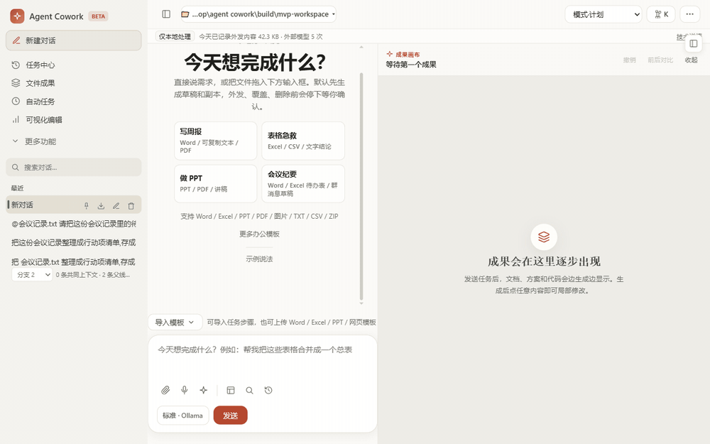

# Agent Cowork

[](https://github.com/zbl1998-sdjn/agent-cowork/actions/workflows/ci.yml)


**A security-first local AI agent workbench for Windows — plans before it acts, asks before it writes, audits everything it sends out.**

面向 Windows 办公场景的本地 AI Agent 工作台:AI 在你电脑上读写文件、执行任务、产出 Word/PPT/Excel——但**写操作先出计划、你批准了才动手**,每一字节出站流量都有审计。



<sub>26 秒真实运行演示（本机 Ollama，无云端 API）：引用工作区文件发起任务 → 模型提交计划、出现「计划待批准」卡 → 批准后执行、`Write` 落盘 `action-items.md` → 产物预览与「仅本地处理」安全状态条。</sub>

> **状态**：v0.4.0 Internal Beta（Tauri 2 桌面壳 + React UI + Node host sidecar）。本地质量门禁全绿、可生成 NSIS 安装包，但尚无可信 CA 代码签名与生产 updater——当前适合源码运行与受控试用，不宣称公开生产可用。

## 为什么做这个

市面上的 agent 工具大多把"能力"堆在前面、把"边界"留给用户自己操心。Agent Cowork 反过来：**先把安全边界做成产品的第一公民**，再谈自动化——因为让 AI 碰真实文件系统的前提，是它每一步都可预测、可审批、可审计。

- **审批门**：写入、覆盖、删除、外发之前，一律停下来等你确认；计划模式下先交完整计划草案，批准后才执行。
- **出站治理**：统一出站网关对模型调用 / WebFetch / 连接器做策略判定，审计留痕到 `egress-audit.jsonl`，前端状态条实时显示当前安全档位与「外发了多少字节」。
- **默认本地**：模型默认走本机 Ollama / LM Studio，不需要任何云端 API key；公网云 provider 在未完成审批链路前 fail-closed，宁可拒绝也不静默放行。

## 快速开始

前置：Windows + Node ≥ 20（实测 Node v24.16.0）。

```powershell
git clone https://github.com/zbl1998-sdjn/agent-cowork.git
cd agent-cowork
npm install
npm run start:mvp   # 启动本地工作台并打开浏览器（默认 http://127.0.0.1:3017）
npm run stop:mvp    # 用完停止
```

让对话走本机 Ollama（先 `ollama pull` 一个模型）：

```powershell
$env:KCW_MODEL_PROVIDER = "openai/local"
$env:KIMI_BASE_URL = "http://127.0.0.1:11434/v1"
$env:KIMI_MODEL = "qwen2.5:14b"
npm run start:mvp
```

一条命令做完整演示验收：`npm run demo:mvp`（启动 + live 操作测试 + 审计，报告写入 `build/mvp-demo-report.json`）。

## 能做什么

| 能力 | 说明 |
|---|---|
| **办公任务一键出活** | 周报、会议纪要转行动项、表格清洗、PPT 初稿、正式 Word、邮件草稿等内置配方，产出 Markdown / DOCX / XLSX / PPTX / PDF；一次真实操作可「存成我的配方」复用 |
| **Agent 工具循环** | 模型自主调用 Read / Write / Edit / Glob / Grep / Shell / WebFetch 多步完成任务；子代理可并发派发、各带独立预算 |
| **计划模式** | 先只读研究 → 提交计划草案 → 用户批准 → 才执行写操作；未批准的写入会被工具层直接阻止 |
| **MCP 连接器** | 完整四层 MCP 协议栈（stdio），命名空间 `mcp__<server>__<tool>`；GitHub OAuth device flow，token 走 Windows DPAPI 加密存储 |
| **Agent Skills 开放标准** | 支持 [agentskills.io](https://agentskills.io) 标准技能包，渐进披露按需加载；技能附带脚本一律不执行、内容按不可信数据包装 |
| **分层记忆** | 内置五层记忆（企业/用户/项目/本地/会话)+ 可选外部 [MASE](https://github.com/zbl1998-sdjn/MASE-agent-memory) 治理记忆后端；所有记忆写入过 DLP 分级、拒绝疑似凭据，注入前再做读侧脱敏 |
| **运行时韧性** | LoopGuard 防循环、有界重试、token/成本/时长硬上限、Checkpoint/Resume 崩溃续跑、InjectionGuard 提示注入检测 |
| **可观测与评测** | 每次 run 带 token/成本/耗时/决策 trace；`npm run eval` 跑 golden + 红队任务集，离线回放确定性回归 |

## 安全模型

5 档安全模式，按数据敏感度选：

| 档位 | 适用 | 行为 |
|---|---|---|
| `local_demo` | 演示/试用 | 本地执行放开，出站仍受审计 |
| `local_strict` | 日常默认 | 只允许本地模型；执行类工具要求网络隔离沙箱（Docker VM：断网、只读、非 root） |
| `enterprise_local` / `air_gap` | 企业内网/离线 | 自动拦截一切对外网络工具 |
| `controlled_hybrid` | 受控混合 | 管理员显式放行的客户网关才可出站 |

底座边界（全档位生效）：trusted root 路径 jail（含 Windows 文件名等价 / NTFS ADS 归一防绕过）+ symlink 解析 + 出站 SSRF 守卫（解析后 IP 判定、逐跳重定向复核）+ Host 头白名单 + JWT 鉴权 + 全链路 `shell:false`。

## 架构

```
Tauri 2 桌面壳 ── React/TypeScript 前端 ── Node host sidecar（同源加载）
                                            ├─ agent 流（SSE tool-loop / 审批 / 计划模式）
                                            ├─ 安全层（出站网关 / 路径 jail / 沙箱 / DLP）
                                            └─ SQLite 存储（PostgreSQL 适配器已备）
```

细节：[数据流](docs/data-flow.md) · [上手指南](docs/Agent-Cowork-上手指南.md) · [扩展开发](docs/EXTENDING.md) · [连接器清单](docs/connector-manifest.md)

## 当前边界（如实说明）

- 未签名安装包、生产 updater、真实 PostgreSQL 多实例部署属于未完成的外部验收；本地门禁绿 ≠ 生产可用。
- 公网云模型（Kimi / OpenAI / Anthropic 等 14+ provider）目前只提供目录与配置发现，执行会被出站网关明确拒绝——审批回执消费链完成前不放行。
- Docker 不可用时沙箱回退宿主机子进程，Windows 下无按进程网络隔离，UI 会明确提示「本地不隔离网络」。

## 开发与验收

合并前完整门禁：`python -X utf8 scripts/quality_gate.py --level full`。全部烟测 / 评测 / 桌面安装验收命令、MASE 桥接配置与冷冻预研代码说明，见 **[docs/开发与验收.md](docs/开发与验收.md)**。

## 作者

[Derrick](https://personal-website-sandy-nine-55.vercel.app/proof) — AI 工程方向,做「可控优先」的 agent 系统。相关项目：[MASE-agent-memory](https://github.com/zbl1998-sdjn/MASE-agent-memory)（LLM agent 的治理型白盒记忆）。

## License

[MIT](LICENSE)
