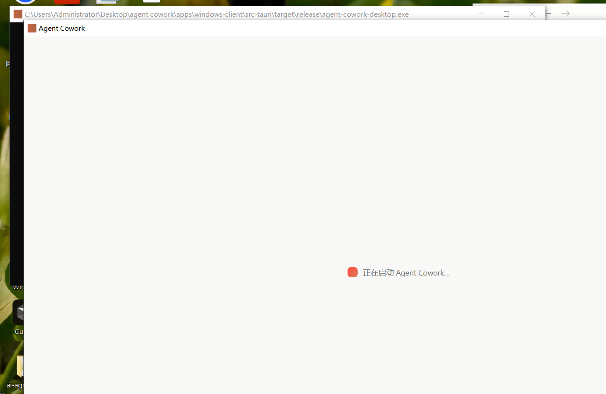
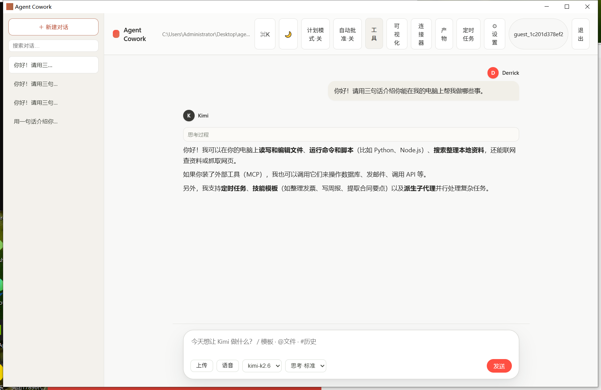
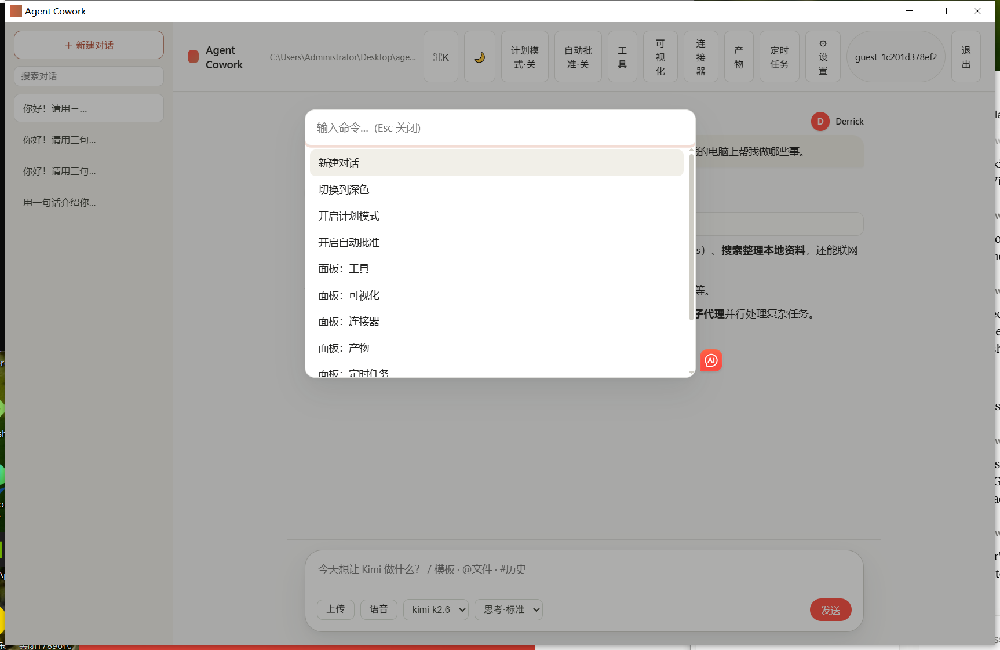
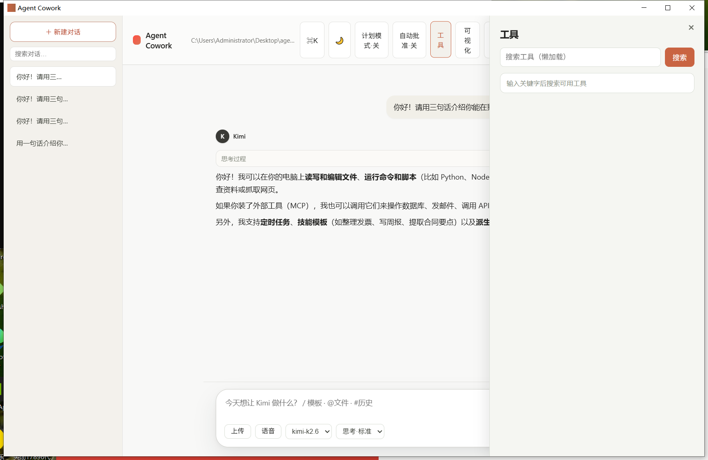
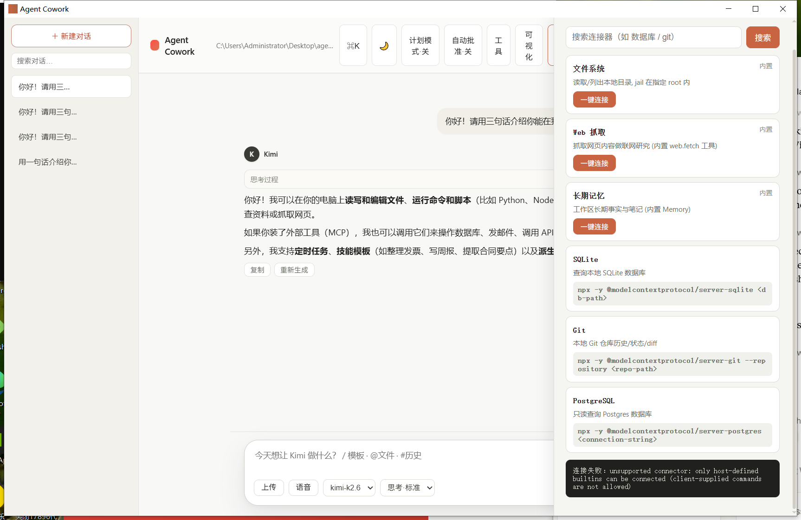
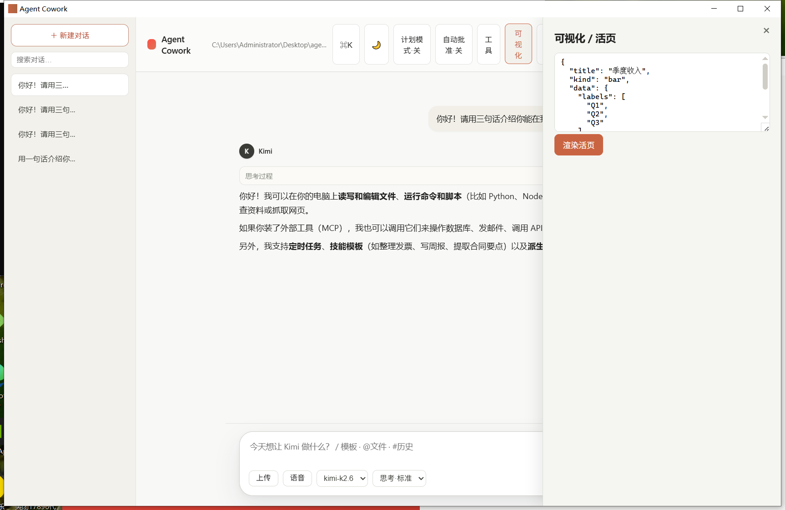
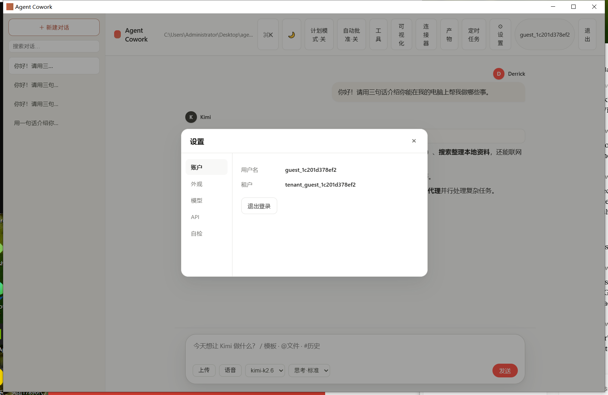
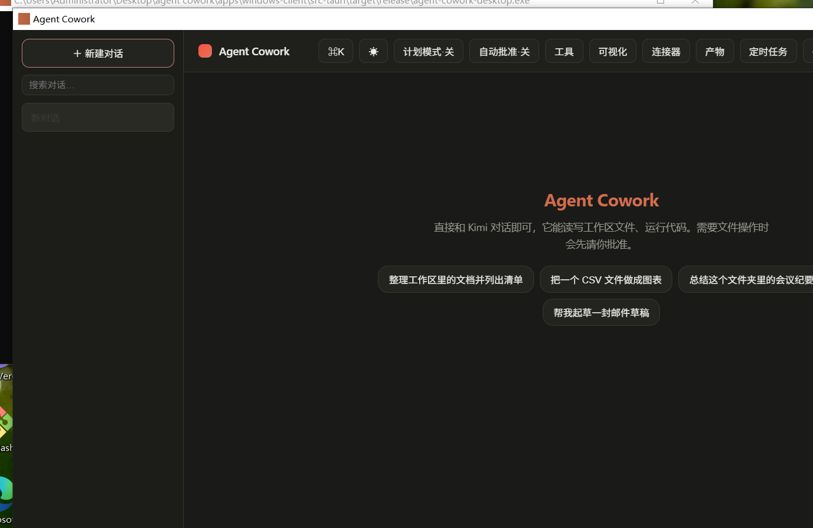

# Agent Cowork 图文上手指南

面向首次使用的用户。Agent Cowork 是一个**本地办公智能体**:它能在你电脑上读写文件、运行代码、连接你的工具,所有操作都在本机完成,关键的写操作会先征得你同意。

> 适用范围:个人电脑本地使用。请勿暴露到公网或当作多人共享的服务器。

---

## 一、安装

在 `installers\` 目录里任选其一:

- **`Agent Cowork_0.1.0_x64-setup.exe`** —— 双击安装(NSIS,普通用户首选)。
- **`Agent Cowork_0.1.0_x64_en-US.msi`** —— 企业/批量部署用。

双击后按提示下一步完成,桌面 / 开始菜单会出现 **Agent Cowork** 图标。

> **关于安全提示**:当前安装包是**自签名**的,首次运行 Windows SmartScreen 会弹"未知发布者"提示。确认来源可信后点 **"更多信息 → 仍要运行"** 即可。
> 要彻底消除这个提示,需用真实 CA 代码签名证书(OV/EV)重新签名:
> ```powershell
> pwsh -NoProfile -ExecutionPolicy Bypass -File scripts\sign-windows.ps1 -Pfx <你的证书.pfx> -Password (Read-Host -AsSecureString)
> ```

---

## 二、首次启动:登录

打开 **Agent Cowork**,先看到登录界面:



两种方式任选其一:

1. **注册 / 登录**:用一个用户名 + 密码(至少 6 位)。账户只保存在本机,用于区分多人的数据。
2. **跳过登录(游客)**:点右下角 **"跳过,先在本地使用 →"** 即可立即开始。游客数据同样保存在本机。

> 账户与会话存储在本机 SQLite(`.AgentCowork/auth.sqlite`),**重启后不会丢失**。

---

## 三、配置 API Key(必须)

Agent Cowork 需要一个 **Kimi / Moonshot 的 API Key** 才能和模型对话。

1. 点右上角 **⚙ 设置 → API**。
2. 在 **API Key** 填入你的 key(形如 `sk-...`),Base URL / 模型一般保持默认即可(默认 `https://api.moonshot.cn/v1` + `kimi-k2.6`)。
3. 点 **保存**。

> **安全说明**:你的 key 只会保存在本机的 `.AgentCowork/config.json`,**永远不会显示明文、也不会上传**。界面只显示"已配置"状态。换 key 时直接覆盖,清除时点"清除密钥"。

---

## 四、选择工作区

Agent 只能在你授权的"工作区根目录"内读写,其外的文件会被拒绝(这是安全设计:软链接 / 越权路径也会被拒绝)。在主界面选择一个你信任的本地文件夹作为工作区即可。

---

## 五、开始使用

配置好之后,在底部输入框直接说需求即可。下图是一轮**真实对话**——问它"用三句话介绍你能帮我做什么",`kimi-k2.6` 模型流式返回了真实回复(回复上方还能展开"思考过程"):



- **对话**:在底部输入框直接说需求,例如"把这个文件夹里的 CSV 汇总成表格"。
- **斜杠命令**:输入 `/` 可快速调用命令(新建对话、设置、切换面板等)和技能模板。
- **@ 引用文件**:输入 `@` 可引用工作区里的文件。
- **文件改动需确认**:当它要写文件或运行命令时,会**先弹出请求,你点同意才执行**。
- **产物预览**:生成的文件出现在"产物"面板,可"在系统中打开";图片 / Markdown / PDF 也能在对话里直接预览。
- **多对话**:左侧栏可新建、搜索、置顶、导出、删除对话;登录用户的对话会按账户保存。
- **本地导入 / 整理**:上传的文件进 `Agent_Cowork上传/<批次>/`;整理类操作把文件移动到 `Agent_Cowork整理/<模板名>/`,并写审计与回滚日志。
- **设置中心**:账户、外观(浅色 / 深色)、模型、API、以及"自检"(查看安全与运行状态)。

### 顶栏功能面板一览

顶栏从右到左依次是:**⚙ 设置、定时任务、产物、连接器、可视化、工具、自动批准、计划模式、🌙 深色、⌘K 命令面板**。下面是几个常用面板的实拍:

**命令面板(⌘K / Ctrl+K)**——一个入口直达所有操作与面板切换:



**工具**——按需懒加载工具,关键字搜索后注入,避免一次性塞满上下文:



**连接器**——一键接入文件系统、网页抓取、长期记忆、SQLite、Git、PostgreSQL 等(MCP):



**可视化 / 活页**——粘贴图表/数据规格即可渲染成活页(Chart / Mermaid):



**设置**——账户 / 外观 / 模型 / API / 自检 五个标签页(API Key 在这里填,只存本机):



**深色模式**——点顶栏 🌙 一键切换:



---

## 六、常见问题

- **一直转圈 / 没反应**:多半是没配置 API Key,或 key 无效。去"设置 → API"检查;"设置 → 自检"里 `api-key` 应为绿色。
- **提示"模型服务暂时不可用,已启用熔断保护"**:上游模型接口连续失败触发了保护,稍等片刻再试。
- **数据存在哪**:对话 / 账户在 `.AgentCowork/`,工作产物在你选择的工作区目录里。
- **想换工作目录**:在设置或主界面重新选择工作区根目录即可。

---

## 七、真实运行验证(已实测)

本版已用真实 Kimi API Key 跑通一轮端到端对话(`kimi-k2.6` 模型,Moonshot 端点):

| 项 | 结果 |
| --- | --- |
| 状态 | `ok: true` |
| 模型 | `kimi-k2.6` |
| 耗时 | ~50.8s(真实模型推理) |
| 运行记录 | `run_20260523134613_...`(已持久化到本机 run 记录) |

模型对"合同草案摘要 → 三条整理建议"的真实回复节选:

> ## 目标理解
> 基于提供的合同草案摘要(涉及甲方、乙方、续约日期、付款条款等核心要素),任务是对该草案进行结构化整理……
>
> ## 三条整理建议
> 1. **主体信息标准化** —— 将甲乙双方的完整法定名称、统一社会信用代码、联系人及送达地址补充至摘要旁,避免后续签署环节歧义。
> 2. **续约日期时序化** —— 以续约日期为锚点,梳理生效日 / 到期日 / 宽限期 / 终止通知期限,整理成清晰时间轴。
> 3. **付款条款结构化** —— 将付款条款拆解为金额、计价方式、账期、支付方式、逾期责任等子项,形成可逐项核对的清单。

> 注:上面这轮是聚焦"模型集成"的 API 级验证(运行时认证门禁默认开启,无令牌访问 `/api` 返回 401)。

### 桌面端 GUI 全链路实测(门禁开启)

随后又在打包好的桌面应用里跑通了**门禁开启**下的完整链路:启动 → 登录(游客)→ 新建对话 → 发送消息 → 收到 `kimi-k2.6` 真实流式回复(即第五节那张截图)。同时逐一打开了命令面板、工具、连接器、可视化、设置等面板,均正常。

排查中定位并修复了一个会导致"登录后聊天回退"的真实缺陷:本机 HTTP 服务的 CORS 响应头 `access-control-allow-headers` **漏了 `authorization`**。结果是——登录本身没带令牌、能成功;但登录后每个带 `Bearer` 令牌的请求都会被 WebView 的 CORS 预检拦掉,`/api/kimi/info` 取不到、聊天就误报"需要配置 Kimi API"。补上 `authorization` 后,桌面端聊天恢复正常,并已加单测防回归。

---

## 八、安全与隐私

- 所有文件操作都被限制在你选择的**工作区根目录**内;指向目录之外的软链接 / 越权路径会被拒绝。
- 本机服务默认要求登录令牌才能调用接口,且不信任伪造的身份头;CSP 锁定 `object-src 'none'`,CORS 拒绝 `Origin: null`。
- 上传会拒绝 `.exe/.bat/.ps1/.html/.svg` 等可执行 / 主动内容类型。
- 日志会自动按大小轮转,不会无限增长。
- 仅监听本机回环地址(127.0.0.1),不对外暴露。

如需把它用于多人 / 联网场景,请联系维护者——那需要额外的部署加固(关闭游客免登录、启用 JWT、代码签名等)。
